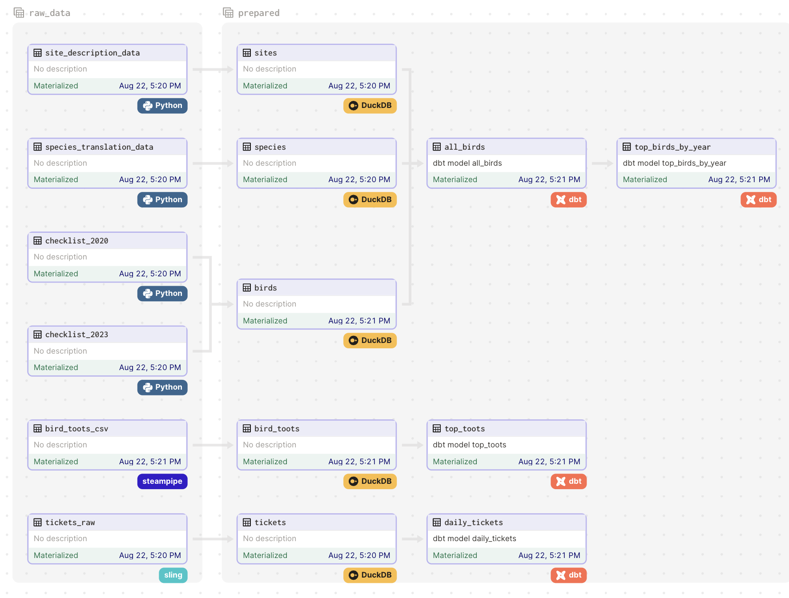

## Open Source MDS



This stack is built on a combination of tools including

- [Dagster](https://dagster.io)
- [DuckDB](https://duckdb.org)
- [dbt](https://www.getdbt.com)
- [dbt-duckdbt](https://github.com/jwills/dbt-duckdb)
- [Evidence](https://evidence.dev)
- [Sling](https://sling.io)
- [Steampipe](https://steampipe.io)


## Requirements

You will need Python installed. This was all tested on Python 3.10.12
From a virtual environment, run

```python
pip install -e .'[dev]'
```
Most of the depdendencies will be installed through Python.

For Evidence.dev, you will need [nodejs](https://nodejs.org/en/download) installed

Install [Sling](https://docs.slingdata.io/sling-cli/getting-started) for getting data from Postgres.

```
# On Mac, view the website for other platforms
brew install slingdata-io/sling/sling
```


Steampipe is a separate requirement for the Mastodon API, and can be installed by following the [instructions here](https://steampipe.io/downloads)

On Apple, run:

```shell
brew install turbot/tap/steampipe
steampipe plugin install turbot/mastodon
```

For the Mastodon API, create an Access Token. I used the [birds.town](https://birds.town/settings/applications)
instance.

Update `~/.steampipe/config/mastodon.spc` with your token and instance:

```
connection "mastodon" {
    plugin = "mastodon"
    server = "https://birds.town"
    access_token = "abcd12345supersecretpassword"
    max_toots = -1
}
```

And run

```shell
dagster dev
```

Load up dagster at http://localhost:3000/asset-groups/

And click Materialize all to run the end-to-end pipeline.


## Visualization

Evidence.dev is used for visualization.

First, go the `dbt_project` folder

```
cd dbt_project

npm --prefix ./reports install
npm --prefix ./reports run dev -- --port 4000
```

